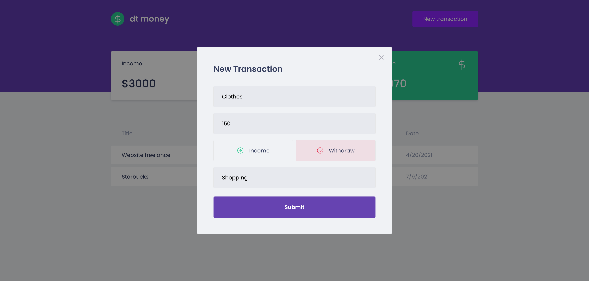
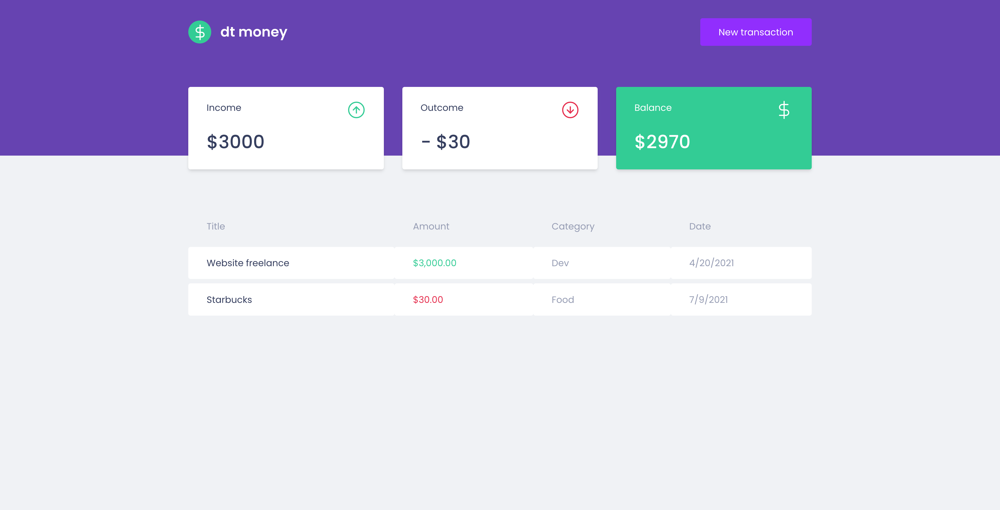
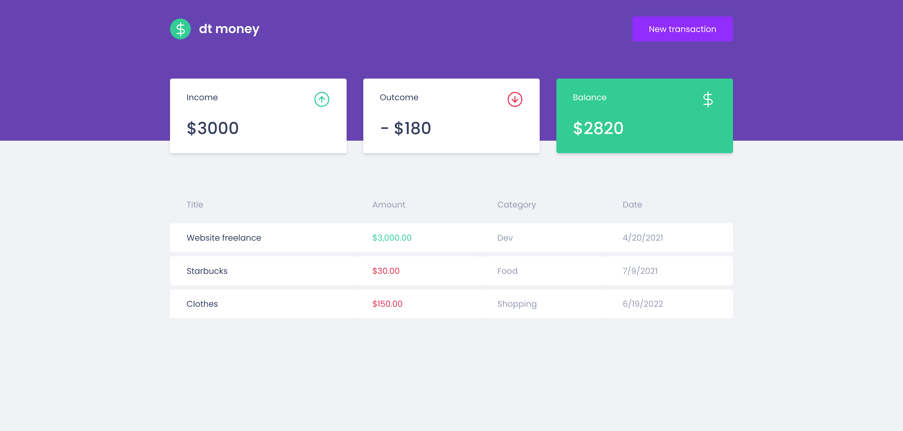

 # dt money
<div align="center" display="flex id="top">            
   
</div>

<hr/>
<br>

## About

This is a personal finance manager application using MirageJS as an API mocking library .

## Screenshots

<div align="center" id="top"> 
   
 
</div>
<br/>
<br/>
<div align="center" id="top"> 
  
</div>
<br/>
<br/>
<div align="center" id="top"> 
  
</div>

## Features

- Table with personal finance data with name, amount, category and date.
- Summary cards with incomes, outcomes and balance.
- New transaction modal.

## Technologies

The following tools were used in this project:

- [React](https://pt-br.reactjs.org/)
- [TypeScript](https://www.typescriptlang.org/)
- [MirageJS](https://miragejs.com/)
- [Polished](https://polished.js.org/)
- [Axios](https://github.com/axios/axios)
- [Styled Components](https://styled-components.com/)

## Requirements

Before starting 🚀, you need to have [Git](https://git-scm.com) and [Node](https://nodejs.org/en/) installed.

## Starting

```bash
# Clone this project
$ git clone https://github.com/davi1985/dtmoney

# Access
$ cd dtmoney

# Install dependencies
$ yarn

# Run the project
$ yarn start

# The server will initialize in the <http://localhost:3000>
```

## License

This project is under license from MIT. For more details, see the [LICENSE](LICENSE.md) file.

Made with 💜 by <a href="https://github.com/Bru-marques/" target="_blank">Bruna Marques</a>

&#xa0;

<a href="#top">Back to top</a>
